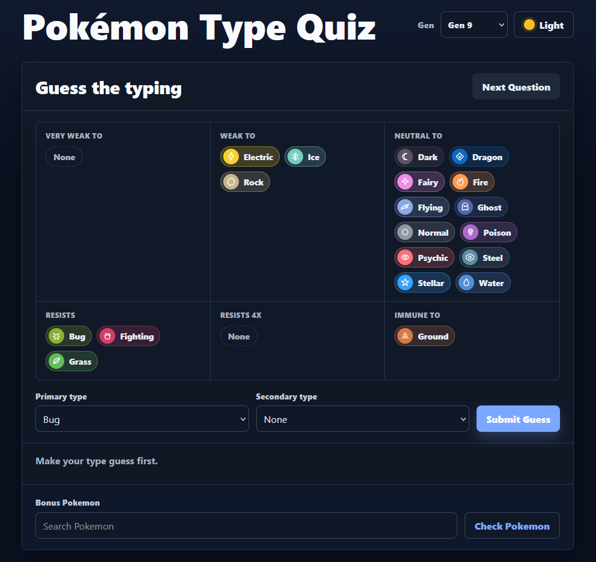

# Pokémon Type Quiz

A small quiz to guess Pokémon typings!

Try it out: [https://fulllifegames.com/Tools/TypeQuiz/](https://fulllifegames.com/Tools/TypeQuiz/)!

## Motivation

- Provide an interactive web quiz that asks users to guess a Pokémon's defensive typing from weaknesses, resistances, and immunities and lay groundwork for species/sprite-based extensions.

## Description

- A Vite + TypeScript web app and a `package.json` with `@pkmn/dex`, `vite`, and `typescript` dependencies.
- `index.html` and `src/main.ts` which use `Dex` to enumerate canonical types and species, pick random species-backed typing targets, compute defensive profiles with `getEffectiveness`/`getImmunity`, and validate normalized guesses.
- UI elements (type selects, hints panel, result reveal, and `Next Question` flow) and dark-theme styles in `src/styles.css`.
- `.gitignore` and a note in the UI about a future extension to use `@pkmn/img` for rendering species sprites and a "guess the Pokémon" mode.
